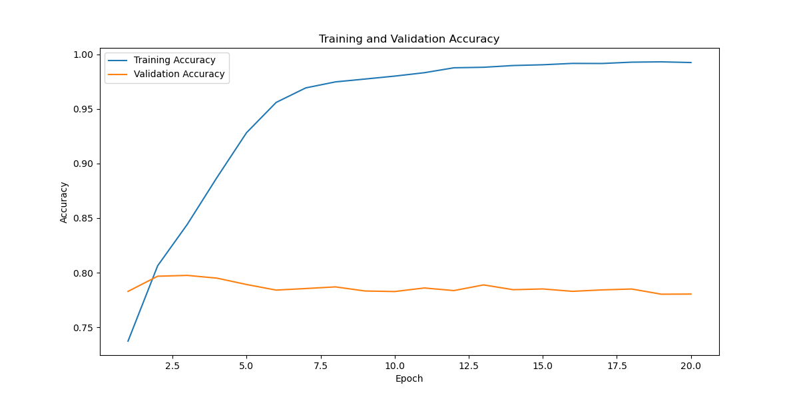

# Tweet Sentiment Analysis using Multiple Traditional Models and Hugging Face BERT and GPT2 with LSTM

This repository contains code for performing sentiment analysis on tweets using a variety of traditional machine learning models as well as advanced techniques leveraging Hugging Face BERT and GPT2 with LSTM.

## Overview

Sentiment analysis on tweets has become increasingly important for understanding public opinion on various topics, ranging from politics to entertainment. This repository provides a comprehensive approach to sentiment analysis, incorporating both traditional and state-of-the-art natural language processing (NLP) models.

## Traditional Machine Learning Models

We experiment with several traditional machine learning models, including Logistic Regression, Multinomial Naive Bayes, and XGBoost. These models serve as baseline approaches for sentiment analysis on tweets.

## Advanced Techniques with Hugging Face BERT and GPT2

In addition to traditional models, we explore advanced techniques by leveraging Hugging Face tokenization with BERT and GPT2. These models offer more nuanced understanding of text data, capturing complex patterns and semantics.

## LSTM Integration

To further enhance the performance of BERT and GPT2 models, we integrate LSTM (Long Short-Term Memory) recurrent neural networks. LSTM provides sequential modeling capabilities, enabling effective training and fine-tuning of the advanced NLP models.


## Conclusion

Our experiments reveal insights into the efficacy of traditional machine learning models versus advanced NLP techniques for sentiment analysis on tweets. While advanced models like BERT and GPT2 offer improvements in accuracy, the complexity and computational demands warrant careful consideration. By striking a balance between traditional and advanced approaches, we aim to develop robust sentiment analysis solutions tailored to the nuances of Twitter data.

## Usage

- **train:** train models using the `allinone.py` script.

Example usage:

```bash
make train
```

## Prerequisites(recommend to use Conda)

Ensure you have the required dependencies installed. You can install them using Conda:

```bash
conda create -f env.yml
```

## Results

### Word Cloud Images
- Positive Words Cloud
  
- Negative Words Cloud
  

### Confusion Matrix Images
- Confusion Matrix for Logistic Regression
  
- Confusion Matrix for Multinomial Naive Bayes
  
- Confusion Matrix for XGBoost
  

### Loss and Accuracy Curve Images
- Loss Curve for LSTM
  
- Accuracy Curve for LSTM
  
- Loss Curve for LSTM with GPT-2
  
- Accuracy Curve for LSTM with GPT-2
  


## Contributing

Contributions are welcome! If you have any ideas for improvement or new features, feel free to open an issue or submit a pull request.

## License

This project is licensed under the MIT License - see the [LICENSE](LICENSE) file for details.


